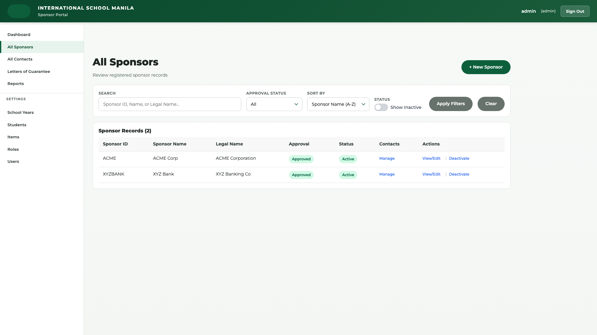
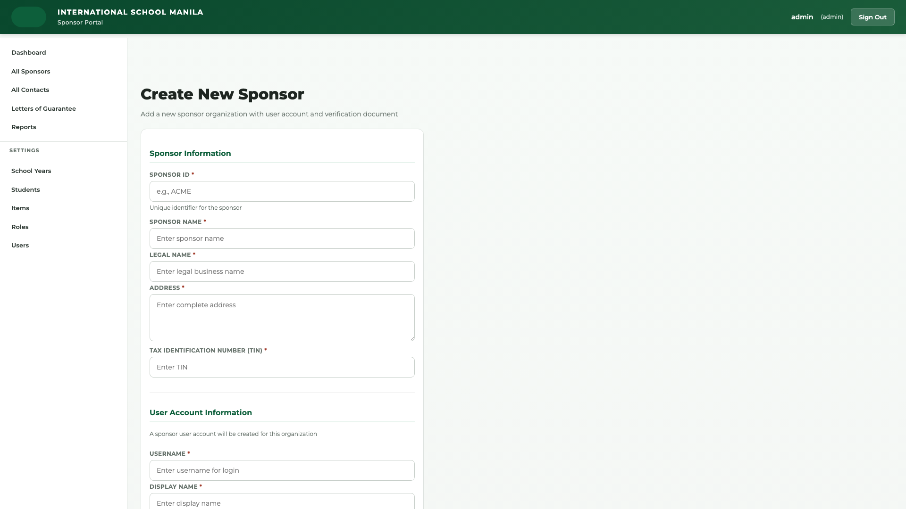
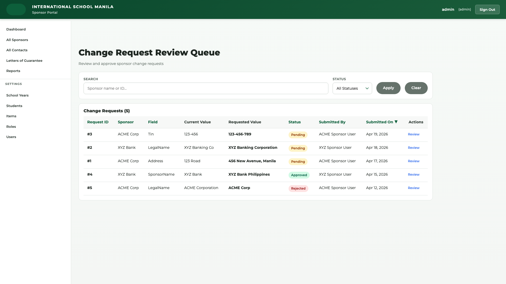
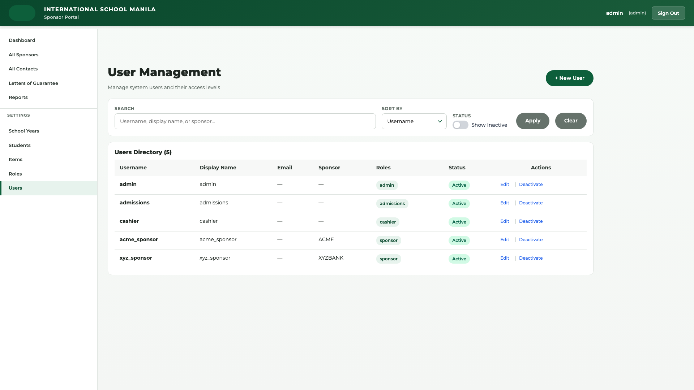

# Administrator User Manual
## ISM Sponsor Management System

**Version:** 1.0  
**Last Updated:** April 23, 2026  
**Role:** System Administrator  
**Access Level:** Full System Access

---

## Table of Contents

1. [Role Overview](#role-overview)
2. [Getting Started](#getting-started)
3. [Dashboard Guide](#dashboard-guide)
4. [Sponsor Management](#sponsor-management)
5. [Letter of Guarantee (LoG) Management](#letter-of-guarantee-log-management)
6. [Request Review & Approval](#request-review--approval)
7. [System Administration](#system-administration)
8. [Reports & Analytics](#reports--analytics)
9. [Operations & Monitoring](#operations--monitoring)
10. [Advanced Features](#advanced-features)
11. [Troubleshooting](#troubleshooting)
12. [FAQs](#faqs)

---

## Role Overview

### Administrator Responsibilities

As a **System Administrator**, you have the highest level of access and responsibility in the ISM Sponsor Management System. Your role encompasses:

**Primary Responsibilities:**
- ✅ Manage all sponsor records (create, edit, merge, delete)
- ✅ Activate and deactivate Letters of Guarantee (LoGs)
- ✅ Review and approve/reject change requests from Admissions staff
- ✅ Manage system users and role assignments
- ✅ Configure system settings (school years, students, items, coverage rules)
- ✅ Monitor system health and integration status
- ✅ Generate comprehensive reports across all areas
- ✅ View complete audit trails
- ✅ Handle duplicate sponsor resolution
- ✅ Manage feedback and system issues

**Key Capabilities:**
- 🔑 **Full CRUD Access:** Create, Read, Update, Delete all records
- 🔑 **Approval Authority:** Final approval on all change requests
- 🔑 **System Configuration:** Manage users, roles, school years, coverage codes
- 🔑 **Operations Access:** Monitor system health, sync status, integration logs
- 🔑 **Merge Authority:** Resolve duplicate sponsors
- 🔑 **Override Capability:** Handle exceptional cases
- 🔑 **Audit Access:** View all system activity logs

**System Access:**
- All sponsor records across all school years
- All LoGs across all school years
- User management and role configuration
- System settings and configuration
- PowerSchool integration monitoring
- Complete audit log access
- All report types (Admin, Admissions, Cashier, Sponsor)

---

## Getting Started

### Initial Login

  
*Figure 1.1: System login page with email and password fields*

1. **Navigate to System URL:**
   ```
   Production: https://ismsponsor.azurewebsites.net
   Staging: [Your staging URL]
   ```

2. **Enter Credentials:**
   - Email: your.admin@ism.edu.ph
   - Password: [Your secure password]
   
3. **Security Note:**
   - Change default password on first login
   - Enable two-factor authentication (if available)
   - Use strong password (12+ characters, mixed case, numbers, symbols)

4. **Dashboard Access:**
   - Upon successful login, you'll see the **Admin Dashboard**
   - Dashboard shows system overview and pending work

### Navigation Overview

**Main Navigation Bar (Top):**
```
[Home] [Dashboard] [Sponsors] [Portal] [Reports] [Settings] [Operations]
```

**Dashboard Navigation:**
- **Home** → System landing page
- **Dashboard** → Admin dashboard with metrics and alerts
- **Sponsors** → Sponsor management (Settings/Sponsors)
- **Portal** → Letter of Guarantee management
- **Reports** → Admin Reports section
- **Settings** → System configuration
  - Users
  - Roles
  - School Years
  - Students
  - Items
  - Sponsors (management)
- **Operations** → System health monitoring

**User Menu (Top-Right):**
```
[Your Name ▼]
  ├─ Profile
  ├─ Feedback
  └─ Logout
```

### Interface Elements

**Search & Filter:**
- Most list views include search boxes and filters
- Search is case-insensitive
- Filters can be combined for precise results

**Action Buttons:**
- 🟦 Blue buttons = Primary actions (Create, Save, Approve)
- 🟧 Orange buttons = Secondary actions (Edit, Review)
- 🟥 Red buttons = Destructive actions (Delete, Reject, Deactivate)
- ⚪ Gray buttons = Cancel or back actions

**Status Indicators:**
- 🟢 Green badge = Active, Approved, Success
- 🟡 Yellow badge = Pending, In Review
- 🔴 Red badge = Inactive, Rejected, Error
- 🔵 Blue badge = Draft, New
- ⚫ Gray badge = Archived, Deprecated

---

## Dashboard Guide

### Admin Dashboard Overview

**URL:** `/Dashboard/AdminDashboard` or `/Dashboard`

  
*Figure 2.1: Admin Dashboard showing system overview and key metrics*

The Admin Dashboard provides a comprehensive view of system status, pending work, and key metrics.

### Dashboard Sections

#### 1. Key Statistics (Top Row)

  
*Figure 2.2: Dashboard statistics showing key metrics at a glance*

**Statistics Card Layout:**
```
┌─────────────────┬─────────────────┬─────────────────┬─────────────────┐
│ Active Sponsors │ Pending Requests│ Active LoGs     │ System Health   │
│     245         │       8         │      423        │    98%          │
│ ↗ +12 this month│ ⚠ Needs review  │ 📊 View all     │ ✅ All systems  │
└─────────────────┴─────────────────┴─────────────────┴─────────────────┘
```

**Metrics Explained:**

1. **Active Sponsors:** 
   - Total count of sponsors with `IsActive = true`
   - Click card to view → `/Settings/Sponsors`
   - Shows trend (increase/decrease from last month)

2. **Pending Requests:**
   - Count of change requests awaiting approval
   - Click to review → `/ReviewRequest/Index`
   - ⚠ Alert indicator if > 5 pending requests

3. **Active LoGs:**
   - Total Letters of Guarantee with `IsActive = true`
   - Click to view → `/Portal/Index`
   - Filters by current school year by default

4. **System Health:**
   - Overall system status percentage
   - Click for details → `/Operations/Dashboard`
   - ✅ Green = All systems operational
   - ⚠ Yellow = Minor issues detected
   - 🔴 Red = Critical issues require attention

#### 2. Recent System Alerts

**Alert Types:**

🔴 **Critical Alerts:**
- Sync failures with PowerSchool
- Database connectivity issues
- Authentication service down
- Data integrity errors

🟡 **Warning Alerts:**
- High number of pending requests (> 10)
- Duplicate sponsors detected
- Inactive LoGs with recent activity
- Users with failed login attempts

🔵 **Information Alerts:**
- System updates available
- New features deployed
- Maintenance scheduled
- Report generation completed

**Alert Actions:**
- Click alert to view details
- Use "Dismiss" to remove from dashboard
- Critical alerts cannot be dismissed until resolved
- View all alerts → `/Operations/Dashboard`

#### 3. Pending Change Requests

**Request Card Display:**
```
┌──────────────────────────────────────────────────────┐
│ 📝 Sponsor Name Change                               │
│ Submitted by: admin.admissions@ism.edu.ph           │
│ Sponsor: Global Tech Corporation (SP-12345)         │
│ Submitted: April 22, 2026 2:30 PM                   │
│ [Review] [Approve] [Reject]                          │
└──────────────────────────────────────────────────────┘
```

**Quick Actions:**
- **Review:** View full request details
- **Approve:** Immediately approve request
- **Reject:** Open rejection form (reason required)

**Request Details Include:**
- Field being changed
- Current value vs. proposed value
- Submitting user and timestamp
- Business justification (if provided)
- Related sponsor information

#### 4. Recent Activity Log

Shows last 10 system actions:
- User logins
- Sponsor creations/updates
- LoG activations
- Request approvals/rejections
- User management changes

**Activity Entry Format:**
```
👤 john.admin@ism.edu.ph
   Approved change request for SP-12345
   April 23, 2026 10:45 AM
```

#### 5. Quick Actions Panel

**One-Click Actions:**
- 📝 Create New Sponsor
- 📄 Create New LoG
- 👥 Review Pending Requests
- 📊 Generate Admin Report
- 👤 Manage Users
- ⚙️ System Settings
- 📈 View Operations Dashboard

**Usage:**
- Click any quick action to navigate directly
- Most-used actions for administrators
- Customizable (future enhancement)

### Dashboard Refresh

**Auto-Refresh:**
- Dashboard auto-refreshes every 5 minutes
- Manual refresh: Click browser refresh or F5
- Real-time alerts appear without refresh

**Performance Tips:**
- Dashboard loads ~500ms on good connection
- If slow, check Operations for system issues
- Clear browser cache if experiencing issues

---

## Sponsor Management

### Overview

As Administrator, you have complete control over sponsor records including create, edit, merge, and delete operations.

### Workflow 1: Create New Sponsor

**URL:** `/Settings/Sponsors` → "Create New Sponsor"

  
*Figure 3.1: Sponsors list view with search and filter options*

**Step-by-Step:**

1. **Navigate to Sponsors:**
   - Dashboard → Settings → Sponsors
   - Or: Main Menu → Settings → Sponsors

2. **Click "Create New Sponsor"**

  
*Figure 3.2: Create sponsor form with required fields marked*

3. **Fill Required Fields (marked with *):**

   **Basic Information:**
   ```
   Sponsor ID*:        [SP-12345]  ← Unique identifier (your format)
   Sponsor Name*:      [Global Tech Corporation]  ← Display name
   Legal Name*:        [Global Tech Corporation Pty Ltd]  ← Legal entity
   ```

   **Contact Information:**
   ```
   Contact Person*:    [John Smith]  ← Primary contact
   Contact Email*:     [john.smith@globaltech.com]  ← Valid email
   Contact Phone*:     [+63 2 1234 5678]  ← Phone with country code
   Alternative Email:  [info@globaltech.com]  ← Optional
   Alternative Phone:  [+63 917 123 4567]  ← Optional
   ```

   **Address Information:**
   ```
   Address Line 1*:    [123 Ayala Avenue]  ← Street address
   Address Line 2:     [Makati Finance Center]  ← Building/Unit (Optional)
   City*:              [Makati City]
   State/Province*:    [Metro Manila]
   Postal Code:        [1226]  ← Optional but recommended
   Country*:           [Philippines]  ← Dropdown selection
   ```

   **Status:**
   ```
   ☑ Is Active         ← Check for active sponsor
   ```

4. **Click "Create" Button**

5. **Confirmation:**
   - Success message appears: "Sponsor created successfully"
   - Redirected to sponsor detail page
   - Sponsor appears in sponsors list

**Best Practices:**

✅ **Sponsor ID Convention:**
- Use consistent format: `SP-XXXXX` or company abbreviation
- Ensure uniqueness (system validates)
- Cannot be changed after creation

✅ **Legal Name vs. Sponsor Name:**
- **Legal Name:** Full official entity name (for contracts)
- **Sponsor Name:** Common/display name (for UI)
- Example: Legal = "ABC Corporation Pty Ltd", Sponsor = "ABC Corp"

✅ **Contact Information:**
- Use primary contact for official communications
- Alternative contacts for backup
- Validate email addresses before saving

✅ **Address Completeness:**
- Complete addresses help with mail correspondence
- Use international format for foreign sponsors
- Postal codes useful for sorting/reports

**Common Mistakes:**

❌ **Duplicate Sponsor ID:**
- System prevents duplicate IDs
- If error appears, check existing sponsors first
- Use search to find similar sponsors

❌ **Missing Required Fields:**
- Form highlights missing fields in red
- Complete all * marked fields before submitting
- Email format must be valid (contains @)

❌ **Inactive Sponsors by Default:**
- New sponsors should be marked "Is Active"
- Inactive sponsors don't appear in most dropdowns
- Reactivate later if needed

### Workflow 2: Search & Filter Sponsors

**URL:** `/Settings/Sponsors`

**Basic Search:**

1. **Search Box (Top of List):**
   ```
   🔍 [Search sponsors...              ] [Search]
   ```

2. **Search Criteria:**
   - Sponsor ID (exact or partial)
   - Sponsor Name (case-insensitive)
   - Legal Name
   - Contact Person name
   - Contact Email

3. **Search Tips:**
   - Partial matches work: "tech" finds "Global Tech"
   - Case insensitive: "ABC" = "abc" = "Abc"
   - Email search: "john.smith" or full email
   - ID search: "SP-12" finds SP-12345, SP-12346, etc.

**Advanced Filters:**

```
┌─────────────────────────────────────────────────────┐
│ Filters:                                            │
│ Status:     [All ▼] [Active] [Inactive]            │
│ Country:    [All ▼] [Philippines] [USA] [Other]    │
│ Created:    [From: ______] [To: ______]            │
│ Modified:   [From: ______] [To: ______]            │
│ [Apply Filters] [Clear Filters]                    │
└─────────────────────────────────────────────────────┘
```

**Filter Combinations:**
- Multiple filters work together (AND logic)
- Example: Active + Philippines = Active sponsors in Philippines
- Clear filters to reset view

**Results Display:**

```
┌────────────┬──────────────────────┬─────────────────┬──────────┬─────────┐
│ Sponsor ID │ Sponsor Name         │ Contact Person  │ Status   │ Actions │
├────────────┼──────────────────────┼─────────────────┼──────────┼─────────┤
│ SP-12345   │ Global Tech Corp     │ John Smith      │ 🟢 Active│ [View]  │
│ SP-12346   │ ABC Corporation      │ Jane Doe        │ 🟢 Active│ [View]  │
│ SP-12347   │ XYZ Holdings         │ Bob Johnson     │ 🔴 Inact.│ [View]  │
└────────────┴──────────────────────┴─────────────────┴──────────┴─────────┘
```

**Pagination:**
- Results show 25 sponsors per page
- Use pagination controls at bottom: `[<< Previous] [1] [2] [3] ... [Next >>]`
- Shows total count: "Showing 1-25 of 245 sponsors"

**Export Options:**
- Click "Export to CSV" to download results
- Includes all filtered sponsors
- Use for reporting or analysis

### Workflow 3: View Sponsor Details

**URL:** `/Settings/Sponsors/Details/{id}`

  
*Figure 3.3: Complete sponsor details page with all information and actions*

**Access Methods:**
1. Click sponsor name from list
2. Click "View" button in actions column
3. Direct URL with sponsor ID

**Details Page Sections:**

#### A. Sponsor Information Card

```
┌───────────────────────────────────────────────────────────┐
│ SP-12345 | Global Tech Corporation                 🟢 Active│
├───────────────────────────────────────────────────────────┤
│ Legal Name:          Global Tech Corporation Pty Ltd      │
│ Contact Person:      John Smith                           │
│ Contact Email:       john.smith@globaltech.com            │
│ Contact Phone:       +63 2 1234 5678                      │
│ Alternative Email:   info@globaltech.com                  │
│ Alternative Phone:   +63 917 123 4567                     │
│                                                            │
│ Address:             123 Ayala Avenue                     │
│                      Makati Finance Center                │
│                      Makati City, Metro Manila 1226       │
│                      Philippines                          │
│                                                            │
│ Created:             March 15, 2026 by admin@ism.edu.ph   │
│ Last Modified:       April 22, 2026 by admissions@ism.ph  │
├───────────────────────────────────────────────────────────┤
│ [Edit] [View LoGs] [View Audit Log] [Deactivate]        │
└───────────────────────────────────────────────────────────┘
```

#### B. Associated Letters of Guarantee

**LoG List (By School Year):**

```
School Year: [2025-2026 ▼]

┌────────────┬─────────────┬──────────────┬──────────┬─────────┐
│ LoG ID     │ Student     │ Coverage     │ Status   │ Actions │
├────────────┼─────────────┼──────────────┼──────────┼─────────┤
│ LOG-2526-01│ Smith, John │ Full Medical │ 🟢 Active│ [View]  │
│ LOG-2526-02│ Doe, Jane   │ Tuition Only │ 🟢 Active│ [View]  │
│ LOG-2425-01│ Smith, John │ Full Medical │ ⚫ Past  │ [View]  │
└────────────┴─────────────┴──────────────┴──────────┴─────────┘

Summary: 2 active LoGs, 1 past LoG for this sponsor
```

#### C. Recent Activity

Shows last 10 actions related to this sponsor:
```
📝 April 22, 2026 2:30 PM
   Sponsor name changed from "Global Tech" to "Global Tech Corporation"
   By: admin.admissions@ism.edu.ph

📄 April 20, 2026 10:15 AM
   Created new LoG LOG-2526-02 for student Doe, Jane
   By: admin.admissions@ism.edu.ph

✏️ March 15, 2026 9:00 AM
   Sponsor record created
   By: admin@ism.edu.ph
```

#### D. Action Buttons

**Edit:**
- Opens edit form with current values
- Admin can edit all fields
- Changes are audited

**View LoGs:**
- Filters LoG list to this sponsor only
- Shows all school years
- Quick navigation to LoG details

**View Audit Log:**
- Complete history of changes
- Shows who, what, when
- Export capability

**Deactivate/Activate:**
- Toggle sponsor active status
- Confirmation required
- Inactive sponsors hidden from most views

### Workflow 4: Edit Sponsor

**URL:** `/Settings/Sponsors/Edit/{id}`

**Step-by-Step:**

1. **Navigate to Sponsor Details** (see Workflow 3)

2. **Click "Edit" Button**

3. **Edit Form Appears:**
   - All fields populated with current values
   - Sponsor ID is read-only (cannot change)
   - Modify any editable field

4. **Fields You Can Edit:**
   - Sponsor Name
   - Legal Name
   - Contact Person
   - Contact Email
   - Contact Phone
   - Alternative Email
   - Alternative Phone
   - Address Line 1
   - Address Line 2
   - City
   - State/Province
   - Postal Code
   - Country
   - Is Active status

5. **Save Changes:**
   - Click "Save Changes" button
   - Validation occurs client-side then server-side
   - Success message appears if valid

6. **Audit Trail:**
   - All changes are logged with:
     - Username of editor
     - Timestamp of change
     - Old value → New value
     - Change reason (if provided)

**Admin vs. Admissions Editing:**

**Administrator (You):**
- ✅ Can edit ALL fields directly
- ✅ Changes take effect immediately
- ✅ No approval required
- ✅ Full audit trail maintained

**Admissions Staff:**
- ⚠️ Cannot edit sensitive fields directly (Sponsor ID, Legal Name)
- ⚠️ Must submit "Change Request" for sensitive fields
- ✅ Can edit contact information directly
- ⚠️ Change requests require your approval

**Validation Rules:**

✅ **Sponsor Name:**
- 3-200 characters
- Required field
- Can contain letters, numbers, spaces, punctuation

✅ **Email Addresses:**
- Must be valid email format (contains @)
- Duplicate emails allowed (multiple sponsors may share contacts)
- 254 characters maximum

✅ **Phone Numbers:**
- Flexible format accepted
- Recommended: Include country code
- Example: +63 2 1234 5678 or (02) 1234-5678

✅ **Address:**
- Address Line 1 required
- City, State/Province, Country required
- Postal Code optional but recommended

**Common Edit Scenarios:**

**Scenario 1: Update Contact Person**
```
Reason: Primary contact changed from John Smith to Jane Doe
Action: 
1. Edit sponsor
2. Change Contact Person: "Jane Doe"
3. Change Contact Email: "jane.doe@globaltech.com"
4. Change Contact Phone: "+63 917 234 5678"
5. Save changes
Result: Contact updated immediately, audit log shows change
```

**Scenario 2: Update Address**
```
Reason: Sponsor relocated offices
Action:
1. Edit sponsor
2. Update Address Line 1: "456 New Street"
3. Update City: "Quezon City"
4. Update Postal Code: "1100"
5. Save changes
Result: Address updated, mail will be sent to new location
```

**Scenario 3: Deactivate Sponsor**
```
Reason: Sponsor no longer supporting students
Action:
1. Edit sponsor
2. Uncheck "Is Active" checkbox
3. Save changes
4. (Optional) Add note in audit log
Result: Sponsor hidden from active lists, LoGs remain visible but can't create new ones
```

### Workflow 5: Merge Duplicate Sponsors

**URL:** `/Duplicates/Index`

**When to Merge:**
- Two sponsor records represent same entity
- Data entry error created duplicate
- Sponsor reapplied with new ID

**Warning:** ⚠️ Merging is permanent and cannot be undone. Ensure accuracy before merging.

**Step-by-Step:**

1. **Navigate to Duplicates:**
   - Dashboard → Duplicates
   - Or: Operations → View Duplicates
   - System may auto-detect potential duplicates

2. **Identify Duplicates:**
   - Search for both sponsor records
   - Compare details carefully
   - Verify they represent same entity

3. **Select Primary Sponsor:**
   ```
   Which record should be kept as primary?
   
   ○ SP-12345 | Global Tech Corporation
     Created: March 15, 2026
     LoGs: 5 active LoGs
     
   ● SP-12350 | Global Tech Corp (duplicate)
     Created: April 10, 2026
     LoGs: 2 active LoGs
   
   [Keep SP-12345 as primary]
   ```

4. **Review Merge Impact:**
   ```
   Merge Summary:
   - Primary record: SP-12345 (will be retained)
   - Duplicate record: SP-12350 (will be merged)
   
   Actions that will occur:
   ✓ 2 LoGs from SP-12350 will be reassigned to SP-12345
   ✓ 7 total LoGs will belong to SP-12345
   ✓ SP-12350 record will be marked as merged (not deleted)
   ✓ Audit trail will show merge action
   ✓ All references updated automatically
   
   ⚠️ This action cannot be undone!
   ```

5. **Confirm Merge:**
   - Review carefully
   - Type "MERGE" to confirm
   - Click "Merge Sponsors" button

6. **Post-Merge:**
   - Success message confirms merge
   - Primary sponsor now has all LoGs
   - Duplicate marked as merged (visible in audit)
   - Reports and data reference primary sponsor

**Best Practices:**

✅ **Pre-Merge Checklist:**
- [ ] Verify both records represent same entity
- [ ] Check which has more complete data
- [ ] Review associated LoGs
- [ ] Verify no active pending requests on duplicate
- [ ] Confirm with stakeholders if unsure

✅ **Choose Primary Based On:**
- Most complete contact information
- Oldest creation date (original record)
- Most associated LoGs
- Best data quality

✅ **After Merge:**
- Notify Admissions staff of merged ID
- Update external systems if applicable
- Check reports for data consistency
- Verify LoGs transferred correctly

**Common Merge Scenarios:**

**Scenario 1: Data Entry Duplicate**
```
Situation: Admissions created SP-12345 (March), forgot, created SP-12350 (April)
Solution: Merge SP-12350 into SP-12345 (keep older record)
Result: All data consolidated under SP-12345
```

**Scenario 2: Name Variation Duplicate**
```
Situation: "Global Tech Corporation" vs "Global Tech Corp" (same entity)
Solution: Merge into record with full legal name
Result: Single sponsor record with complete information
```

**Scenario 3: Reapplication Duplicate**
```
Situation: Sponsor exited system (SP-12345 inactive), reapplied (SP-12400)
Solution: Reactivate SP-12345, merge SP-12400 into it
Result: Historical data preserved, new LoGs added to original record
```

### Workflow 6: Delete Sponsor (Rare)

**URL:** `/Settings/Sponsors/Delete/{id}`

**Warning:** 🔴 **Deletion is permanent and should be avoided.** Use deactivation instead.

**When Deletion is Appropriate:**
- Sponsor created by mistake (no LoGs, no activity)
- Test data during system setup
- Duplicate with no historical value
- Data entered completely wrong (better to delete and recreate)

**When NOT to Delete:**
- Sponsor has any LoGs (active or past)
- Sponsor has audit history
- Sponsor referenced in reports
- You're unsure (use deactivate instead)

**Step-by-Step:**

1. **Verify Deletion is Appropriate:**
   - Check sponsor has zero LoGs
   - Check no pending requests reference this sponsor
   - Verify no report data references this sponsor

2. **Navigate to Sponsor Details**

3. **Click "Delete" Button** (if available)

4. **Confirmation Dialog:**
   ```
   ⚠️ Delete Sponsor: SP-12345 | Global Tech Corporation?
   
   This action is permanent and cannot be undone.
   
   Current status:
   - Active LoGs: 0
   - Past LoGs: 0
   - Pending Requests: 0
   - Audit Entries: 3
   
   Are you sure you want to delete this sponsor?
   
   Type "DELETE" to confirm: [________]
   
   [Cancel] [Delete Permanently]
   ```

5. **Type "DELETE" and Confirm**

6. **Post-Deletion:**
   - Sponsor removed from database
   - Cannot be recovered
   - Audit log shows deletion action
   - Redirected to sponsors list

**Alternative to Deletion:**

**Use Deactivation Instead:**
1. Edit sponsor
2. Uncheck "Is Active"
3. Save changes
4. Result: Sponsor hidden but data preserved

**Benefits of Deactivation:**
- Data retained for historical reports
- Can be reactivated if needed
- Audit trail complete
- References remain intact
- Safer approach

---

## Letter of Guarantee (LoG) Management

### Overview

As Administrator, you can create, edit, activate, deactivate, and delete Letters of Guarantee (LoGs). LoGs define coverage rules for sponsored students.

### Workflow 7: View LoGs

**URL:** `/Portal/Index`

  
*Figure 4.1: Letters of Guarantee list with school year selector and filters*

**Access:**
- Main Menu → Portal
- Dashboard → Active LoGs card
- Sponsor Details → View LoGs

**LoG List View:**

**School Year Selector:**
```
School Year: [2025-2026 ▼]  [All] [2026-2027] [2025-2026] [2024-2025]
```

**LoG List Table:**
```
┌─────────────┬────────────────┬──────────────┬──────────────┬──────────┬─────────┐
│ LoG ID      │ Sponsor        │ Student      │ Coverage     │ Status   │ Actions │
├─────────────┼────────────────┼──────────────┼──────────────┼──────────┼─────────┤
│ LOG-2526-01 │ Global Tech    │ Smith, John  │ Full Medical │ 🟢 Active│ [View]  │
│ LOG-2526-02 │ ABC Corp       │ Doe, Jane    │ Tuition      │ 🟡 Draft │ [View]  │
│ LOG-2526-03 │ XYZ Holdings   │ Brown, Bob   │ Partial      │ 🟢 Active│ [View]  │
└─────────────┴────────────────┴──────────────┴──────────────┴──────────┴─────────┘
```

**Filters:**
```
Status:    [All ▼] [Active] [Draft] [Inactive]
Sponsor:   [All ▼] [Search sponsors...]
Student:   [All ▼] [Search students...]
Coverage:  [All ▼] [Full] [Partial] [None]
```

**Status Meanings:**
- 🟢 **Active:** LoG is active and coverage is in effect
- 🟡 **Draft:** LoG created but not yet activated
- 🔴 **Inactive:** LoG deactivated (historical record)
- 🔵 **Pending:** Awaiting review (if workflow enabled)

### Workflow 8: Create New LoG

**URL:** `/Portal/Create`

  
*Figure 4.2: Create LoG form - School year and sponsor selection*

**Prerequisites:**
- Sponsor must exist (create sponsor first if needed)
- Student must exist (sync from PowerSchool or manual entry)
- School year must be configured

**Step-by-Step:**

1. **Navigate to Portal:**
   - Main Menu → Portal
   - Click "Create New LoG"

2. **Select School Year:**
   ```
   School Year*: [2025-2026 ▼]
   ```
   ⚠️ **Important:** Verify correct school year selected!

3. **Select Sponsor:**
   ```
   Sponsor*: [Search or select...     ▼]
             [SP-12345 | Global Tech Corporation]
   ```
   - Search by sponsor ID or name
   - Only active sponsors shown
   - If sponsor missing, create sponsor first

4. **Select Student:**
   ```
   Student*: [Search or select...        ▼]
             [123456 | Smith, John - Grade 10]
   ```
   - Search by student ID or name
   - Shows: Student ID | Last Name, First Name - Grade Level
   - Only students in selected school year shown

5. **LoG Details:**
   ```
   LoG Number:           [LOG-2526-01]  ← Auto-generated or manual
   Issue Date*:          [04/23/2026]   ← Date LoG issued
   Effective Date*:      [08/01/2025]   ← Coverage start date
   Expiry Date*:         [06/30/2026]   ← Coverage end date
   
   Coverage Type*:       [Full Medical ▼]
                         - Full Medical (100% coverage)
                         - Partial Medical (with rules)
                         - Tuition Only
                         - Custom
   
   Special Instructions: [____________________________________________]
                         [____________________________________________]
                         [____________________________________________]
   ```

6. **Coverage Rules:**

  
*Figure 4.3: Adding coverage rules to define what expenses are covered*

   **Add Coverage Rules (Optional but Recommended):**
   
   Click "Add Coverage Rule" to define what's covered:
   
   ```
   Rule #1:
   Item Category:    [Medical ▼]      ← What type of expense
   Coverage Level:   [Covered ▼]      ← Covered/Split/Not Covered
   Percentage:       [100%]            ← If split, what %
   Notes:            [All medical expenses covered except cosmetic procedures]
   [Remove Rule]
   
   Rule #2:
   Item Category:    [Tuition ▼]
   Coverage Level:   [Covered ▼]
   Percentage:       [100%]
   Notes:            [Full tuition coverage]
   [Remove Rule]
   
   Rule #3:
   Item Category:    [Dental ▼]
   Coverage Level:   [Split ▼]
   Percentage:       [50%]
   Notes:            [50% coverage up to PHP 20,000 per year]
   [Remove Rule]
   
   [+ Add Another Rule]
   ```

7. **Attachments (Optional):**
   ```
   Upload LoG Document: [Choose File] [No file chosen]
   
   Accepted formats: PDF, DOC, DOCX, JPG, PNG
   Maximum size: 10 MB
   ```

8. **Save as Draft or Activate:**
   
   **Option A: Save as Draft**
   - Saves LoG but doesn't activate coverage
   - Can edit later before activation
   - Useful for review process
   - Click "Save as Draft"
   
   **Option B: Save and Activate**
   - Saves and immediately activates LoG
   - Coverage becomes effective
   - Cannot edit certain fields after activation
   - Click "Save and Activate"

9. **Confirmation:**
   ```
   ✅ LoG Created Successfully!
   
   LoG ID: LOG-2526-01
   Sponsor: Global Tech Corporation
   Student: Smith, John
   Status: Active
   
   [View LoG Details] [Create Another LoG] [Back to List]
   ```

**Best Practices:**

✅ **Date Validation:**
- Effective Date should align with school year start
- Expiry Date should align with school year end
- Issue Date is typically date of creation
- Effective Date ≤ Expiry Date (system validates)

✅ **Coverage Rules:**
- Be specific about what's covered
- Use percentages for split coverage
- Add notes for clarification
- Common categories:
  - Medical (doctor visits, hospital, medication)
  - Dental (cleanings, procedures)
  - Tuition (full or partial)
  - Books & Materials
  - Uniforms
  - Activities & Field Trips
  - Laboratory Fees

✅ **Coverage Type Quick Reference:**
- **Full Medical:** All medical expenses 100% covered
- **Partial Medical:** Medical covered with rules/limits
- **Tuition Only:** Only tuition fees covered
- **Custom:** Define your own rules

✅ **Special Instructions:**
- Pre-authorization requirements
- Spending limits per category
- Excluded items
- Contact information for claims
- Special conditions

**Common Scenarios:**

**Scenario 1: Full Sponsorship**
```
Coverage Type: Full Medical
Rules:
- Medical: Covered 100%
- Dental: Covered 100%
- Tuition: Covered 100%
- Books: Covered 100%
- Activities: Covered 100%
Special Instructions: "Full sponsorship with no exclusion s"
```

**Scenario 2: Medical Only**
```
Coverage Type: Partial Medical
Rules:
- Medical: Covered 100%
- Dental: Covered 100%
- Tuition: Not Covered
- Books: Not Covered
- Activities: Not Covered
Special Instructions: "Medical expenses only. Tuition to be paid by family."
```

**Scenario 3: Split Coverage**
```
Coverage Type: Custom
Rules:
- Medical: Split 80% (sponsor) / 20% (family)
- Dental: Split 50% / 50%
- Tuition: Covered 100%
- Books: Split 75% / 25%
- Activities: Not Covered
Special Instructions: "Cost-sharing arrangement. Family pays remaining balance."
```

### Workflow 9: Edit LoG (Draft)

**URL:** `/Portal/Edit/{id}`

**When You Can Edit:**
- LoG status is "Draft"
- All fields are editable
- No coverage has been claimed yet

**Step-by-Step:**

1. **Navigate to LoG Details** (see Workflow 7)

2. **Click "Edit" Button** (only visible if editable)

3. **Edit Form:**
   - Same fields as create form
   - Current values pre-populated
   - Change any field as needed

4. **Save Changes:**
   - Click "Save Changes" to keep as draft
   - Click "Save and Activate" to activate now
   - Changes are audited

**Editing Active LoGs:**

⚠️ **Limited editing for active LoGs:**
- Cannot change: Sponsor, Student, School Year, LoG Number
- Can change: Special Instructions, Attachments
- To modify coverage rules: Must deactivate, edit, reactivate
- Or: Create new LoG for new school year

### Workflow 10: Activate LoG

**URL:** `/Portal/Activate/{id}`

**Prerequisites:**
- LoG must be in "Draft" status
- All required fields must be complete
- Coverage rules should be defined

**Step-by-Step:**

1. **Navigate to LoG Details**

2. **Review LoG Information:**
   - Verify sponsor is correct
   - Verify student is correct
   - Verify dates are accurate
   - Verify coverage rules are complete
   - Check special instructions

3. **Click "Activate" Button**

4. **Confirmation Dialog:**
   ```
   ⚠️ Activate LoG: LOG-2526-01?
   
   Once activated, certain fields cannot be edited.
   
   Current LoG Details:
   - Sponsor: Global Tech Corporation
   - Student: Smith, John
   - School Year: 2025-2026
   - Coverage: Full Medical
   - Effective: 08/01/2025 to 06/30/2026
   
   Are you sure you want to activate this LoG?
   
   [Cancel] [Activate LoG]
   ```

5. **Click "Activate LoG"**

6. **Post-Activation:**
   - Status changes to "Active"
   - Coverage is now in effect
   - LoG appears in active reports
   - Cashier can use for billing verification

**What Happens When LoG is Activated:**
- ✅ Coverage rules take effect
- ✅ Cashier can verify coverage against this LoG
- ✅ Reports include this LoG
- ✅ Student's sponsor information visible
- ⚠️ Limited editing capabilities
- ⚠️ Must deactivate to make major changes

### Workflow 11: Deactivate LoG

**URL:** `/Portal/Deactivate/{id}`

**When to Deactivate:**
- Student leaves school mid-year
- Sponsor withdraws support
- LoG information needs major correction
- Coverage period ends early

**Step-by-Step:**

1. **Navigate to LoG Details**

2. **Click "Deactivate" Button**

3. **Deactivation Form:**
   ```
   Deactivate LoG: LOG-2526-01
   
   Reason for deactivation*: [▼ Select reason]
     - Student Left School
     - Sponsor Withdrew Support
     - Coverage Period Ended
     - Needs Correction
     - Other (specify below)
   
   Effective Deactivation Date*: [04/23/2026]
   
   Additional Notes: [__________________________________________________]
                    [__________________________________________________]
                    [__________________________________________________]
   
   ⚠️ Deactivating this LoG will:
   - Stop coverage from effective date
   - Mark LoG as inactive
   - Retain all historical data
   - Allow reactivation if needed
   
   [Cancel] [Deactivate LoG]
   ```

4. **Click "Deactivate LoG"**

5. **Confirmation:**
   ```
   ✅ LoG Deactivated Successfully
   
   LoG ID: LOG-2526-01
   Status: Inactive
   Deactivated: April 23, 2026
   Reason: Sponsor Withdrew Support
   
   [View LoG Details] [Back to List]
   ```

**Post-Deactivation:**
- ✅ LoG marked as inactive
- ✅ Coverage stops from deactivation date
- ✅ Historical data preserved
- ✅ Appears in reports as inactive
- ✅ Can be reactivated if needed

**Reactivation:**
- Navigate to deactivated LoG details
- Click "Reactivate" button
- Provide reactivation reason
- Coverage resumes

---

## Request Review & Approval

### Overview

Admissions staff cannot directly edit certain sensitive sponsor fields. Instead, they submit **Change Requests** that require your approval as Administrator.

### Workflow 12: Review Pending Requests

**URL:** `/ReviewRequest/Index`

  
*Figure 5.1: List of pending change requests requiring review*

**Access:**
- Dashboard → Pending Requests card
- Main Menu → Review Requests
- Direct navigation to requests page

**Requests List:**

```
┌────────┬─────────────────┬──────────────────┬─────────────────┬──────────┬─────────┐
│ Req ID │ Request Type    │ Sponsor          │ Submitted By    │ Date     │ Actions │
├────────┼─────────────────┼──────────────────┼─────────────────┼──────────┼─────────┤
│ CR-001 │ Name Change     │ SP-12345 Global  │ admin.admissions│ 04/22/26 │ [Review]│
│ CR-002 │ Address Update  │ SP-12346 ABC     │ staff.admissions│ 04/21/26 │ [Review]│
│ CR-003 │ Contact Update  │ SP-12347 XYZ     │ admin.admissions│ 04/20/26 │ [Review]│
└────────┴─────────────────┴──────────────────┴─────────────────┴──────────┴─────────┘

Status Filter: [All ▼] [Pending] [Approved] [Rejected]
```

**Request Types:**
- **Name Change:** Sponsor name or legal name modification
- **ID Change:** Sponsor ID update (rare, requires strong justification)
- **Legal Name Update:** Legal entity name change
- **Major Address Change:** Complete address relocation
- **Merge Request:** Request to merge duplicate sponsors
- **Deletion Request:** Request to delete sponsor (rare)

### Workflow 13: Approve Request

**URL:** `/ReviewRequest/Details/{id}`

**Step-by-Step:**

1. **Click "Review" on Request**

2. **Review Request Details:**
   ```
   ┌──────────────────────────────────────────────────────────┐
   │ Change Request: CR-001                                   │
   │ Status: 🟡 Pending Approval                              │
   ├──────────────────────────────────────────────────────────┤
   │ Request Type:     Name Change                            │
   │ Submitted By:     admin.admissions@ism.edu.ph           │
   │ Submitted Date:   April 22, 2026 2:30 PM                │
   │                                                          │
   │ Sponsor Information:                                     │
   │ Sponsor ID:       SP-12345                              │
   │ Current Name:     Global Tech                           │
   │ Legal Name:       Global Tech Corporation Pty Ltd       │
   │                                                          │
   │ Requested Change:                                        │
   │ Field:            Sponsor Name                          │
   │ Current Value:    "Global Tech"                         │
   │ Proposed Value:   "Global Tech Corporation"             │
   │                                                          │
   │ Justification:                                           │
   │ "Sponsor requested we use their full formal name in     │
   │  all communications. Updated based on official          │
   │  document provided by sponsor contact."                 │
   │                                                          │
   │ Supporting Documents:                                    │
   │ 📎 sponsor_letter.pdf (uploaded 04/22/2026)             │
   ├──────────────────────────────────────────────────────────┤
   │ Administrator Action Required                            │
   │                                                          │
   │ This change will:                                        │
   │ ✓ Update sponsor display name in all interfaces         │
   │ ✓ Maintain LoG references (no LoG changes needed)       │
   │ ✓ Update reports to show new name going forward         │
   │ ✓ Preserve audit trail of name change                   │
   │                                                          │
   │ [Approve Request] [Reject Request] [Request More Info]  │
   └──────────────────────────────────────────────────────────┘
   ```

3. **Review Checklist:**
   - ☑ Is the change justified?
   - ☑ Is the justification clear and reasonable?
   - ☑ Are supporting documents provided?
   - ☑ Does the change make sense?
   - ☑ Will the change cause issues elsewhere?
   - ☑ Is the proposed value accurate?

4. **Click "Approve Request"**

5. **Approval Form (Optional):**
   ```
   Approve Change Request: CR-001
   
   Approval Notes (Optional):
   [Approved. Name change aligns with sponsor's official documentation.]
   [____________________________________________________________]
   
   Notify Submitter: ☑ Send email notification
   
   [Cancel] [Confirm Approval]
   ```

6. **Click "Confirm Approval"**

7. **Post-Approval:**
   ```
   ✅ Request Approved Successfully
   
   Request ID: CR-001
   Change has been applied automatically.
   
   Updated:
   - Sponsor Name: "Global Tech" → "Global Tech Corporation"
   - Status: Approved
   - Approved By: admin@ism.edu.ph
   - Approved Date: April 23, 2026 10:15 AM
   
   [View Sponsor Details] [Back to Requests]
   ```

**What Happens After Approval:**
- ✅ Change is applied immediately to sponsor record
- ✅ Request status changes to "Approved"
- ✅ Audit log updated with approval details
- ✅ Email notification sent to submitter (if enabled)
- ✅ Dashboard pending count decreases
- ✅ Change appears in activity feed

### Workflow 14: Reject Request

**URL:** `/ReviewRequest/Reject/{id}`

**When to Reject:**
- Change is not justified
- Proposed value is incorrect
- Supporting documentation missing or inadequate
- Change would cause data integrity issues
- Better approach available (merge vs. edit)

**Step-by-Step:**

1. **Review Request Details** (see Workflow 13, steps 1-3)

2. **Click "Reject Request"**

3. **Rejection Form:**
   ```
   Reject Change Request: CR-001
   
   Reason for Rejection*: [▼ Select reason]
     - Insufficient Justification
     - Incorrect Proposed Value
     - Missing Documentation
     - Data Integrity Concerns
     - Alternative Action Recommended
     - Other (specify below)
   
   Rejection Notes*: [____________________________________________]
                     [Please provide more documentation showing   ]
                     [the official name change. Current letter    ]
                     [appears to be informal email, not official. ]
                     [____________________________________________]
   
   Recommended Action (Optional):
   [Request official documentation from sponsor's legal dept.]
   [____________________________________________]
   
   Notify Submitter: ☑ Send email notification
   
   ⚠️ Rejecting this request will:
   - Not apply the change
   - Mark request as rejected
   - Notify submitter with reason
   - Allow re-submission with corrections
   
   [Cancel] [Confirm Rejection]
   ```

4. **Click "Confirm Rejection"**

5. **Post-Rejection:**
   ```
   Request Rejected
   
   Request ID: CR-001
   Status: Rejected
   Rejected By: admin@ism.edu.ph
   Rejected Date: April 23, 2026 10:20 AM
   
   Reason: Missing Documentation
   
   Submitter has been notified and can resubmit with corrections.
   
   [Back to Requests] [View Sponsor]
   ```

**Best Practices:**

✅ **Provide Clear Feedback:**
- Explain exactly why rejected
- Suggest what's needed for approval
- Be specific about documentation requirements
- Maintain professional tone

✅ **Rejection Reasons:**
- Must be constructive
- Should guide correction
- Include examples if helpful
- Reference policies if applicable

✅ **Follow-Up:**
- Check if request is resubmitted
- Review corrections when resubmitted
- Approve if corrections adequate

### Workflow 15: Request More Information

**URL:** `/ReviewRequest/RequestInfo/{id}`

**When to Use:**
- Need clarification on justification
- Need additional documentation
- Need confirmation from sponsor
- Need more context

**Step-by-Step:**

1. **Review Request Details**

2. **Click "Request More Info"**

3. **Information Request Form:**
   ```
   Request Additional Information: CR-001
   
   What information is needed?: [_____________________________]
   [Please provide official documentation showing the name    ]
   [change, such as:                                          ]
   [- Updated business registration                           ]
   [- Official letter from sponsor on letterhead              ]
   [- Contract or agreement showing new name                  ]
   [                                                           ]
   [Current email is insufficient for official name change.   ]
   [____________________________________________________________]
   
   Due Date (Optional): [04/30/2026]
   
   Notify Submitter: ☑ Send email notification
   
   [Cancel] [Send Information Request]
   ```

4. **Click "Send Information Request"**

5. **Post-Request:**
   ```
   Information Requested
   
   Request ID: CR-001
   Status: Awaiting Additional Information
   Requested By: admin@ism.edu.ph
   Requested Date: April 23, 2026 10:25 AM
   
   Submitter has been notified.
   Request will remain pending until information provided.
   
   [Back to Requests]
   ```

**Request Status Updates:**
- Status changes to "Awaiting Information"
- Request remains in your pending queue
- Submitter receives email with details
- Submitter can respond via system
- You're notified when information provided
- Can then approve or reject

---

## System Administration

### User Management

**URL:** `/Settings/Users`

As Administrator, you manage all system users including creation, role assignment, activation/deactivation, and password resets.

### Workflow 16: View Users

  
*Figure 6.1: User management list showing all users, roles, and status*

**Users List:**

```
┌─────────────────────────────┬──────────────┬────────────┬──────────┬─────────┐
│ Email                       │ Full Name    │ Roles      │ Status   │ Actions │
├─────────────────────────────┼──────────────┼────────────┼──────────┼─────────┤
│ admin@ism.edu.ph           │ John Admin   │ Admin      │ 🟢 Active│ [Edit]  │
│ admin.admissions@ism.edu.ph│ Jane Smith   │ Admissions │ 🟢 Active│ [Edit]  │
│ cashier@ism.edu.ph         │ Bob Jones    │ Cashier    │ 🟢 Active│ [Edit]  │
│ sponsor@ism.edu.ph         │ Mary Sponsor │ Sponsor    │ 🔴 Inact.│ [Edit]  │
└─────────────────────────────┴──────────────┴────────────┴──────────┴─────────┘
```

**Filters:**
```
Role:      [All ▼] [Admin] [Admissions] [Cashier] [Sponsor]
Status:    [All ▼] [Active] [Inactive] [Locked]
Search:    [Search by name or email...]
```

### Workflow 17: Create New User

**Step-by-Step:**

1. **Click "Create New User"**

2. **User Creation Form:**
   ```
   Create New User
   
   Email Address*:     [new.user@ism.edu.ph]
                       (Will be used for login)
   
   Full Name*:         [First Last]
   
   Role Assignment*:   ☑ Admin
                       ☐ Admissions
                       ☐ Cashier
                       ☐ Sponsor
                       (Select one or more)
   
   Initial Password*:  [____________] [Generate]
                       (User must change on first login)
   
   Send Welcome Email: ☑ Send email with login instructions
   
   Account Status:     ☑ Active (user can login immediately)
   
   [Cancel] [Create User]
   ```

3. **Click "Create User"**

4. **Post-Creation:**
   ```
   ✅ User Created Successfully
   
   Email: new.user@ism.edu.ph
   Roles: Admissions
   Status: Active
   
   Initial Password: TempPass123!
   
   ⚠️ Share this password securely with the user.
   User will be required to change password on first login.
   
   [View User] [Create Another User] [Back to Users]
   ```

**Password Requirements:**
- Minimum 8 characters
- At least one uppercase letter
- At least one lowercase letter
- At least one number
- At least one special character
- Cannot be same as email or name

### Workflow 18: Edit User

**URL:** `/Settings/Users/Edit/{id}`

**What You Can Edit:**
- Full Name
- Role assignments
- Account status (Active/Inactive)
- Email (with caution - affects login)
- Force password reset

**Step-by-Step:**

1. **Click "Edit" on User**

2. **Edit Form:**
   ```
   Edit User: admin.admissions@ism.edu.ph
   
   Email Address*:     [admin.admissions@ism.edu.ph]
                       ⚠️ Changing email changes login credentials
   
   Full Name*:         [Jane Smith]
   
   Current Roles:      ☐ Admin
                       ☑ Admissions
                       ☐ Cashier
                       ☐ Sponsor
   
   Account Status:     ☑ Active
                       ☐ Inactive (prevents login)
                       ☐ Locked (temporarily disabled)
   
   Password Management:
   ☐ Require password change on next login
   ☐ Unlock account (if locked due to failed attempts)
   [Reset Password] ← Generates new temporary password
   
   [Cancel] [Save Changes]
   ```

3. **Save Changes**

**Role Changes:**
- User's permissions update immediately
- Current session remains active
- Changes apply on next login
- Can assign multiple roles (e.g., Admin + Admissions)

**Account Status:**
- **Active:** User can login normally
- **Inactive:** User cannot login (soft delete)
- **Locked:** Temporarily locked (failed login attempts)

### Workflow 19: Reset User Password

**When to Use:**
- User forgot password
- Security concern (reset required)
- Account compromise suspected
- User's email changing

**Step-by-Step:**

1. **Navigate to User Edit Page**

2. **Click "Reset Password" Button**

3. **Password Reset Form:**
   ```
   Reset Password for: admin.admissions@ism.edu.ph
   
   New Temporary Password: [____________] [Generate]
   
   ☑ Require user to change password on next login
   ☑ Send password reset email to user
   
   Reason for Reset: [▼ Select reason]
     - User Requested
     - Forgot Password
     - Security Concern
     - Other
   
   [Cancel] [Reset Password]
   ```

4. **Click "Reset Password"**

5. **Post-Reset:**
   ```
   ✅ Password Reset Successfully
   
   New Temporary Password: NewPass456!
   
   ⚠️ Share this password securely with the user.
   Email sent to: admin.admissions@ism.edu.ph
   
   User must change password on next login.
   
   [Back to User] [Back to Users List]
   ```

**Security Best Practices:**
- Generate strong temporary passwords
- Always require change on first login
- Communicate password securely (not via email)
- Log password reset in audit trail
- Consider sending reset link instead of password

### Role Management

**URL:** `/Settings/Roles`

Manage system roles and their permissions.

### Workflow 20: View Roles

**Roles List:**

```
┌──────────────┬─────────────────────────────┬────────────┬─────────┐
│ Role Name    │ Description                 │ User Count │ Actions │
├──────────────┼─────────────────────────────┼────────────┼─────────┤
│ Admin        │ Full system access          │ 3          │ [View]  │
│ Admissions   │ Sponsor & LoG management    │ 8          │ [View]  │
│ Cashier      │ Read-only access + reports  │ 5          │ [View]  │
│ Sponsor      │ Self-service portal         │ 245        │ [View]  │
└──────────────┴─────────────────────────────┴────────────┴─────────┘
```

**Role Permissions Summary:**

```
┌─────────────────────────┬───────┬────────────┬─────────┬─────────┐
│ Permission              │ Admin │ Admissions │ Cashier │ Sponsor │
├─────────────────────────┼───────┼────────────┼─────────┼─────────┤
│ View Sponsors           │  ✅   │     ✅     │   ✅    │   ✅*   │
│ Create Sponsors         │  ✅   │     ✅     │   ❌    │   ❌    │
│ Edit Sponsors (All)     │  ✅   │     ⚠️**   │   ❌    │   ❌    │
│ Delete Sponsors         │  ✅   │     ❌     │   ❌    │   ❌    │
│ Merge Sponsors          │  ✅   │     ❌     │   ❌    │   ❌    │
│                         │       │            │         │         │
│ View LoGs               │  ✅   │     ✅     │   ✅    │   ✅*   │
│ Create LoGs             │  ✅   │     ✅     │   ❌    │   ❌    │
│ Edit LoGs (Draft)       │  ✅   │     ✅     │   ❌    │   ❌    │
│ Edit LoGs (Active)      │  ✅   │     ❌     │   ❌    │   ❌    │
│ Activate/Deactivate LoGs│  ✅   │     ❌     │   ❌    │   ❌    │
│                         │       │            │         │         │
│ Approve Requests        │  ✅   │     ❌     │   ❌    │   ❌    │
│ Submit Requests         │  ❌   │     ✅     │   ❌    │   ✅*** │
│                         │       │            │         │         │
│ Manage Users            │  ✅   │     ❌     │   ❌    │   ❌    │
│ Manage Roles            │  ✅   │     ❌     │   ❌    │   ❌    │
│ System Settings         │  ✅   │     ❌     │   ❌    │   ❌    │
│                         │       │            │         │         │
│ Admin Reports           │  ✅   │     ❌     │   ❌    │   ❌    │
│ Admissions Reports      │  ✅   │     ✅     │   ❌    │   ❌    │
│ Cashier Reports         │  ✅   │     ✅     │   ✅    │   ❌    │
│ Sponsor Reports         │  ✅   │     ❌     │   ❌    │   ✅*   │
│                         │       │            │         │         │
│ Audit Logs (All)        │  ✅   │     ⚠️**** │   ❌    │   ❌    │
│ Operations Dashboard    │  ✅   │     ❌     │   ❌    │   ❌    │
│ System Health Monitoring│  ✅   │     ❌     │   ❌    │   ❌    │
└─────────────────────────┴───────┴────────────┴─────────┴─────────┘

*    Own data only
**   Via change request for sensitive fields
***  Future feature
**** Own actions only
```

### Configuration Settings

**School Years**

**URL:** `/Settings/SchoolYears`

Manage academic years for the system.

### Workflow 21: Manage School Years

**School Years List:**

```
┌──────────────┬────────────┬──────────┬────────────┬─────────┐
│ School Year  │ Start Date │ End Date │ Status     │ Actions │
├──────────────┼────────────┼──────────┼────────────┼─────────┤
│ 2026-2027    │ 08/01/2026 │ 06/30/27 │ 🔵 Future  │ [Edit]  │
│ 2025-2026    │ 08/01/2025 │ 06/30/26 │ 🟢 Active  │ [Edit]  │
│ 2024-2025    │ 08/01/2024 │ 06/30/25 │ ⚫ Past    │ [View]  │
│ 2023-2024    │ 08/01/2023 │ 06/30/24 │ ⚫ Past    │ [View]  │
└──────────────┴────────────┴──────────┴────────────┴─────────┘
```

**Create School Year:**

1. **Click "Create New School Year"**

2. **School Year Form:**
   ```
   Create School Year
   
   Academic Year*:     [2027-2028]
                       Format: YYYY-YYYY
   
   Start Date*:        [08/01/2027]
   End Date*:          [06/30/2028]
   
   Description:        [Academic Year 2027-2028]
   
   Status:             ○ Future (default for new years)
                       ○ Active (only one active at a time)
                       ○ Past (archived years)
   
   [Cancel] [Create School Year]
   ```

3. **Click "Create School Year"**

**Best Practices:**
- Create next year in advance (for planning)
- Set current year as "Active"
- Only one active school year at a time
- Past years should remain "Past" (read-only data)
- Start/End dates should align with actual academic calendar

**Students Management**

**URL:** `/Settings/Students`

Manage student records (usually synced from PowerSchool).

### Workflow 22: View Students

**Students List:**

```
School Year: [2025-2026 ▼]

┌────────────┬──────────────────┬────────────┬───────────┬─────────┐
│ Student ID │ Name             │ Grade      │ Status    │ Actions │
├────────────┼──────────────────│────────────┼───────────┼─────────┤
│ 123456     │ Smith, John      │ Grade 10   │ 🟢 Active │ [View]  │
│ 123457     │ Doe, Jane        │ Grade 11   │[View]  │
│ 123458     │ Brown, Bob       │ Grade 9    │ 🟢 Active │ [View]  │
└────────────┴──────────────────┴────────────┴───────────┴─────────┘

Total Students: 423 (Showing 1-25)
```

**Student Details:**
- Student ID (from PowerSchool)
- Full Name (Last, First Middle)
- Grade Level
- Homeroom/Section
- Active/Inactive status
- Associated LoGs

**Sync from PowerSchool:**
- Click "Sync Students" button
- Pulls latest student data
- Updates existing records
- Adds new students
- Marks withdrawn students as inactive

**Items Management**

**URL:** `/Settings/Items`

Manage billable items and coverage categories.

### Workflow 23: Manage Items

**Items List:**

```
┌───────────┬──────────────────────────┬──────────────┬──────────┬─────────┐
│ Item Code │ Item Description         │ Category     │ Active   │ Actions │
├───────────┼──────────────────────────┼──────────────┼──────────┼─────────┤
│ TUI-HS    │ High School Tuition      │ Tuition      │ 🟢 Yes   │ [Edit]  │
│ MED-DOC   │ Doctor Consultation      │ Medical      │ 🟢 Yes   │ [Edit]  │
│ MED-HOSP  │ Hospital Confinement     │ Medical      │ 🟢 Yes   │ [Edit]  │
│ DEN-CLEAN │ Dental Cleaning          │ Dental       │ 🟢 Yes   │ [Edit]  │
│ BOOK-SET  │ Textbook Set             │ Books        │ 🟢 Yes   │ [Edit]  │
│ UNI-SET   │ Uniform Set              │ Uniform      │ 🟢 Yes   │ [Edit]  │
└───────────┴──────────────────────────┴──────────────┴──────────┴─────────┘
```

**Create Item:**

```
Create New Item

Item Code*:         [MED-LAB]
                    (Unique identifier)

Item Description*:  [Laboratory Tests]

Category*:          [Medical ▼]
                    - Medical
                    - Dental
                    - Tuition
                    - Books
                    - Uniforms
                    - Activities
                    - Other

Unit Price:         [1,000.00]  (Optional, for reference)

Active:             ☑ Yes

Notes:              [Standard laboratory tests (blood, urine, etc.)]

[Cancel] [Create Item]
```

**Usage:**
- Items define what can be covered by LoGs
- Used in coverage evaluation
- Referenced in billing reports
- Synced with finance system

---

## Reports & Analytics

### Admin Reports Overview

**URL:** `/AdminReports/Index`

As Administrator, you have access to comprehensive reports across all areas of the system.

### Report Categories

#### 1. Sponsor Reports

**Available Reports:**

**A. Sponsor Master Report**
- Complete list of all sponsors
- Status: Active/Inactive
- Contact information
- Address details
- Associated LoGs count
- Creation date
- Last modified date

**Filters:**
- Status (Active/Inactive/All)
- Country
- Creation date range
- Last modified date range

**Export:** CSV, Excel, PDF

**Usage:**
- Data audit and verification
- Sponsor contact list
- Mail merge operations
- External reporting

---

**B. Sponsor Contact List**
- Sponsor ID
- Sponsor Name
- Primary Contact Person
- Contact Email
- Contact Phone
- Alternative contacts

**Filters:**
- Active sponsors only
- Country/Region
- Has active LoGs

**Export:** CSV, Excel

**Usage:**
- Communication campaigns
- Annual surveys
- Emergency contact list

---

**C. Sponsor Activity Report**
- Sponsor engagement metrics
- Number of students supported
- LoGs per sponsor
- Coverage amount (if tracked)
- Activity timeline

**Filters:**
- School year
- Activity level (High/Medium/Low)
- Coverage type

**Export:** CSV, Excel, PDF

**Usage:**
- Identify engaged sponsors
- Recognition programs
- Relationship management

---

#### 2. LoG Reports

**A. Active LoGs Report**
- All active Letters of Guarantee
- Sponsor details
- Student details
- Coverage rules
- Effective dates

**Filters:**
- School year
- Sponsor
- Coverage type
- Grade level

**Export:** CSV, Excel, PDF

**Usage:**
- Coverage verification
- Billing reference
- Audit purposes

---

**B. LoG Expiration Report**
- LoGs expiring soon (within 30/60/90 days)
- Requires renewal
- Proactive planning

**Filters:**
- Expiration date range
- Sponsor
- Grade level

**Export:** CSV, Excel

**Usage:**
- Renewal planning
- Sponsor communication
- Continuity assurance

---

**C. Coverage Summary Report**
- Aggregate coverage by sponsor
- Total students covered
- Coverage types breakdown
- School year comparison

**Filters:**
- School year
- Sponsor
- Coverage category

**Export:** CSV, Excel, PDF

**Usage:**
- Financial planning
- Sponsor contributions analysis
- Fundraising reports

---

#### 3. System Reports

**A. User Activity Report**
- User login history
- Actions performed
- Timestamp details
- IP addresses (if logged)

**Filters:**
- User
- Date range
- Action type

**Export:** CSV

**Usage:**
- Security audit
- Compliance reporting
- Usage analytics

---

**B. Change Request Report**
- All change requests
- Status (Pending/Approved/Rejected)
- Submitter
- Reviewer
- Processing time

**Filters:**
- Status
- Date range
- Submitter
- Request type

**Export:** CSV, Excel

**Usage:**
- Workflow analysis
- Approval metrics
- Process improvement

---

**C. Audit Log Report**
- Complete audit trail
- All system changes
- Who, What, When, Where
- Before/After values

**Filters:**
- Entity type (Sponsor/LoG/User)
- Date range
- User
- Action type (Create/Update/Delete)

**Export:** CSV, Excel

**Usage:**
- Compliance audits
- Data integrity verification
- Security investigation
- Historical analysis

---

### Workflow 24: Generate Report

  
*Figure 7.1: Admin reports menu showing available report types*

**Step-by-Step:**

1. **Navigate to Admin Reports:**
   - Main Menu → Reports → Admin Reports

2. **Select Report Type:**
   - Click report name from list

3. **Configure Filters:**
   ```
   Sponsor Master Report
   
   Filters:
   Status:          [All ▼] [Active] [Inactive]
   Country:         [All ▼] [Philippines] [USA] [Other]
   Created From:    [01/01/2025]
   Created To:      [12/31/2025]
   
   [Clear Filters] [Generate Report]
   ```

4. **Click "Generate Report"**

5. **View Results:**
   ```
   Sponsor Master Report
   Generated: April 23, 2026 10:45 AM
   Filters: Active sponsors, Philippines, Created 2025
   Total Records: 42
   
   [Export to CSV] [Export to Excel] [Export to PDF]
   
   ┌────────────┬──────────────────┬─────────────────┬──────────────┐
   │ Sponsor ID │ Sponsor Name     │ Contact Email   │ Active LoGs  │
   ├────────────┼──────────────────┼─────────────────┼──────────────┤
   │ SP-12345   │ Global Tech Corp │ john@global.com │ 5            │
   │ SP-12346   │ ABC Corporation  │ jane@abc.com    │ 3            │
   │ ...        │ ...              │ ...             │ ...          │
   └────────────┴──────────────────┴─────────────────┴──────────────┘
   
   Showing 1-25 of 42 records
   ```

6. **Export Report:**
   - Click export format button
   - File downloads to browser
   - Open in appropriate application

**Export Formats:**

**CSV:**
- Plain text comma-separated values
- Opens in Excel, Google Sheets
- Good for data import/analysis

**Excel:**
- Microsoft Excel format (.xlsx)
- Formatted with headers
- Includes filters and formulas

**PDF:**
- Formatted for printing
- Includes report header
- Professional appearance
- Good for distribution

---

## Operations & Monitoring

### Operations Dashboard

**URL:** `/Operations/Dashboard`

The Operations Dashboard provides real-time system health monitoring and integration status.

### Workflow 25: Monitor System Health

  
*Figure 8.1: Operations dashboard showing system health and monitoring metrics*

**Dashboard Sections:**

#### 1. System Status Overview

```
┌────────────────────────────────────────────────────────┐
│ System Health: 98%                           🟢 Healthy│
├────────────────────────────────────────────────────────┤
│ Components:                                            │
│   Web Application:     🟢 Operational                  │
│   Database:            🟢 Operational                  │
│   Authentication:      🟢 Operational                  │
│   PowerSchool API:     🟢 Connected                    │
│   Email Service:       🟢 Operational                  │
│   File Storage:        🟢 Operational                  │
│                                                        │
│ Last Updated: April 23, 2026 10:50:15 AM              │
│ [Refresh] [View Details] [Run Health Check]           │
└────────────────────────────────────────────────────────┘
```

**Status Indicators:**
- 🟢 **Operational / Healthy:** All systems functioning normally
- 🟡 **Degraded / Warning:** Minor issues, system still functional
- 🔴 **Down / Critical:** Service unavailable, immediate action required

#### 2. PowerSchool Integration Status

```
┌────────────────────────────────────────────────────────┐
│ PowerSchool Integration                    🟢 Connected│
├────────────────────────────────────────────────────────┤
│ Last Successful Sync: April 23, 2026 6:00 AM          │
│ Next Scheduled Sync:  April 24, 2026 6:00 AM          │
│                                                        │
│ Recent Sync History:                                   │
│   04/23/2026 6:00 AM  ✅ Success  Students: 423       │
│   04/22/2026 6:00 AM  ✅ Success  Students: 421       │
│   04/21/2026 6:00 AM  ✅ Success  Students: 421       │
│   04/20/2026 6:00 AM  ⚠️  Warning  Students: 420 (Slow)│
│                                                        │
│ [Manual Sync Now] [View Sync Logs] [Configure Sync]   │
└────────────────────────────────────────────────────────┘
```

**Sync Actions:**
- **Manual Sync Now:** Trigger immediate sync
- **View Sync Logs:** See detailed sync activity
- **Configure Sync:** Adjust sync schedule and settings

#### 3. Performance Metrics

```
┌────────────────────────────────────────────────────────┐
│ Performance Metrics (Last 24 Hours)                    │
├────────────────────────────────────────────────────────┤
│ Average Response Time:    245 ms                       │
│ Total Requests:           3,456                        │
│ Error Rate:               0.2% (7 errors)              │
│ Uptime:                   99.9%                        │
│                                                        │
│ Database Performance:                                  │
│   Average Query Time:     35 ms                        │
│   Slow Queries (>1s):     2                            │
│   Database Size:          2.8 GB                       │
│   Connection Pool:        8/20 active                  │
│                                                        │
│ [View Detailed Metrics] [Download Performance Report]  │
└────────────────────────────────────────────────────────┘
```

#### 4. Recent Errors & Alerts

```
┌────────────────────────────────────────────────────────┐
│ Recent Errors & Alerts                                 │
├────────────────────────────────────────────────────────┤
│ 🟡 April 23, 2026 9:15 AM                              │
│    Slow database query detected                        │
│    Query took 1.2 seconds (Students list)              │
│    [View Details] [Dismiss]                            │
│                                                        │
│ 🔵 April 23, 2026 8:00 AM                              │
│    Scheduled backup completed successfully             │
│    Size: 2.8 GB, Duration: 3 minutes                   │
│    [View Backup] [Dismiss]                             │
│                                                        │
│ 🟢 April 22, 2026 11:30 PM                             │
│    System update applied successfully                  │
│    Version: 1.2.5 → 1.2.6                              │
│    [View Changelog] [Dismiss]                          │
│                                                        │
│ [View All Alerts] [Clear All]                          │
└────────────────────────────────────────────────────────┘
```

#### 5. User Activity Summary

```
┌────────────────────────────────────────────────────────┐
│ User Activity (Last 24 Hours)                          │
├────────────────────────────────────────────────────────┤
│ Active Users:             12                           │
│ Total Logins:             45                           │
│ Failed Login Attempts:    2                            │
│                                                        │
│ Top Actions:                                           │
│   1. View Sponsors        156 actions                  │
│   2. View LoGs            89 actions                   │
│   3. Edit Sponsors        23 actions                   │
│   4. Create LoGs          12 actions                   │
│   5. Generate Reports     8 actions                    │
│                                                        │
│ [View Detailed Activity] [View User Sessions]          │
└────────────────────────────────────────────────────────┘
```

### Workflow 26: Troubleshoot Issues

**Common Issues & Resolutions:**

#### Issue 1: PowerSchool Sync Failure

**Symptoms:**
- Red status indicator on Operations Dashboard
- "PowerSchool Integration: 🔴 Disconnected"
- Students not updating

**Troubleshooting Steps:**

1. **Check Integration Status:**
   - Navigate to Operations Dashboard
   - Review "PowerSchool Integration" section
   - Note any error messages

2. **View Sync Logs:**
   - Click "View Sync Logs"
   - Look for error details
   - Common errors:
     - Authentication failure (expired credentials)
     - Network connectivity issue
     - API rate limit exceeded
     - Data format mismatch

3. **Verify Credentials:**
   - Navigate to Settings → Integration
   - Check PowerSchool API credentials
   - Verify URL, Client ID, Client Secret
   - Test connection

4. **Manual Sync Attempt:**
   - Click "Manual Sync Now"
   - Monitor progress
   - Check if successful

5. **Contact Support If:**
   - Credentials are correct but sync still fails
   - Error message unclear
   - Issue persists after manual sync

**Resolution:**
- Update credentials if expired
- Retry sync after network issue resolved
- Contact PowerSchool support for API issues

---

#### Issue 2: Slow Performance

**Symptoms:**
- Pages loading slowly (>3 seconds)
- Database queries timing out
- Users reporting delays

**Troubleshooting Steps:**

1. **Check Performance Metrics:**
   - Operations Dashboard → Performance Metrics
   - Review average response time
   - Check database query times
   - Identify slow queries

2. **Database Optimization:**
   - Navigate to Settings → Database
   - Run "Optimize Database" (if available)
   - Update statistics
   - Rebuild indexes

3. **Clear Cache:**
   - Settings → System → Clear Cache
   - Restart application if needed

4. **Check Server Resources:**
   - Operations Dashboard → System Resources
   - CPU usage
   - Memory usage
   - Disk space

5. **Review Recent Changes:**
   - Check if issue started after update
   - Review recent configuration changesSee audit log for system changes

**Resolution:**
- Optimize heavy queries
- Increase server resources if needed
- Rollback recent changes if needed
- Schedule maintenance window

---

#### Issue 3: User Login Issues

**Symptoms:**
- Users cannot login
- "Invalid credentials" error
- Authentication service down

**Troubleshooting Steps:**

1. **Verify User Account:**
   - Settings → Users
   - Search for user
   - Check account status (Active/Inactive/Locked)
   - Check role assignments

2. **Unlock Account (if locked):**
   - Edit user
   - Check "Unlock Account"
   - Save changes
   - Notify user to try again

3. **Reset Password:**
   - If user forgot password
   - Click "Reset Password"
   - Generate temporary password
   - Send to user securely
   - Require change on next login

4. **Check Authentication Service:**
   - Operations Dashboard
   - Verify "Authentication: 🟢 Operational"
   - If red, check service status
   - Restart if needed

5. **Check Browser Issues:**
   - Clear browser cache/cookies
   - Try incognito/private mode
   - Try different browser
   - Check for browser extensions blocking

**Resolution:**
- Unlock/reactivate account
- Reset password
- Restart authentication service
- Clear browser cache

---

## Advanced Features

### Bulk Operations

**URL:** `/Settings/Bulk`

Perform bulk actions on multiple records simultaneously.

### Workflow 27: Bulk Update Sponsors

**When to Use:**
- Update multiple sponsors at once
- Mass status changes (activate/deactivate)
- Bulk data corrections
- Address updates for related sponsors

**Step-by-Step:**

1. **Navigate to Bulk Operations:**
   - Settings → Bulk Operations → Sponsors

2. **Select Sponsors:**
   ```
   Bulk Update Sponsors
   
   Selection Method:
   ○ Select from list (pick individual sponsors)
   ● Filter-based selection (select by criteria)
   ○ Import sponsor IDs from file
   
   Filters:
   Status:       [Active ▼]
   Country:      [Philippines ▼]
   Created From: [01/01/2025]
   Created To:   [12/31/2025]
   
   [Apply Filters]
   
   42 sponsors match these criteria
   [Select All] [Deselect All]
   ```

3. **Preview Selection:**
   ```
   Selected Sponsors (42):
   SP-12345 | Global Tech Corporation
   SP-12346 | ABC Corporation
   SP-12347 | XYZ Holdings
   ... (39 more)
   
   [Edit Selection]
   ```

4. **Choose Update Action:**
   ```
   Bulk Action:  [▼ Select action]
     - Update Status (Activate/Deactivate)
     - Update Country
     - Update Address Field
     - Add Note/Tag
     - Export Selection
   
   Selected: Update Status
   
   New Status:   ○ Active
                 ● Inactive
   
   Reason:       [Mass deactivation for fiscal year end]
   
   ⚠️ This will update 42 sponsor records.
   [Cancel] [Preview Changes] [Apply Bulk Update]
   ```

5. **Preview Changes:**
   ```
   Preview: 42 sponsors will be deactivated
   
   Example records:
   SP-12345: Active → Inactive
   SP-12346: Active → Inactive
   SP-12347: Active → Inactive
   ...
   
   ⚠️ This action cannot be undone for all records at once.
   Consider testing with a small subset first.
   
   [Cancel] [Apply to All 42 Records]
   ```

6. **Apply Bulk Update:**
   - Click "Apply to All Records"
   - Progress bar shows update status
   - Completion message shows results

7. **Review Results:**
   ```
   ✅ Bulk Update Complete
   
   Successfully updated: 42 records
   Failed: 0 records
   
   Details:
   - 42 sponsors deactivated
   - Audit log entries created: 42
   - Time elapsed: 2.3 seconds
   
   [View Updated Sponsors] [Download Report] [Back]
   ```

**Best Practices:**

✅ **Test First:**
- Test on a small subset (5-10 records)
- Verify results before full update
- Use "Preview Changes" feature

✅ **Backup:**
- Export current data before bulk update
- Keep backup for 30 days
- Document bulk changes

✅ **Audit:**
- All bulk updates are logged
- Individual audit entries per record
- Can trace bulk operation ID

❌ **Avoid:**
- Bulk updates without testing
- Updates during peak usage hours
- Updates without backup

### Data Import/Export

**URL:** `/Settings/Import` or `/Settings/Export`

Import or export data in bulk using CSV/Excel files.

### Workflow 28: Import Sponsors from CSV

**When to Use:**
- Initial system setup
- Migrate from old system
- Bulk sponsor addition
- Data restoration

**Step-by-Step:**

1. **Navigate to Import:**
   - Settings → Import → Sponsors

2. **Download Template:**
   ```
   Import Sponsors from CSV
   
   Step 1: Download Template
   [Download CSV Template] [Download Excel Template]
   
   Template includes:
   - Required fields (marked with *)
   - Optional fields
   - Field descriptions
   - Example data
   ```

3. **Prepare CSV File:**
   ```
   Sponsor ID,Sponsor Name,Legal Name,Contact Person,Contact Email,...
   SP-12345,"Global Tech","Global Tech Corp Pty","John Smith","john@global.com",...
   SP-12346,"ABC Corp","ABC Corporation","Jane Doe","jane@abc.com",...
   ```

4. **Upload File:**
   ```
   Step 2: Upload File
   [Choose File] [sponsors_import.csv]  [Upload]
   
   File Requirements:
   - Format: CSV or Excel (.xlsx)
   - Maximum size: 10 MB
   - Maximum records: 1,000 per file
   - Encoding: UTF-8
   ```

5. **Validate Data:**
   ```
   Step 3: Validation Results
   
   File: sponsors_import.csv
   Total Rows: 42
   
   Validation Summary:
   ✅ Valid records: 40
   ⚠️  Warnings: 2
   ❌ Errors: 0
   
   Warnings:
   Row 15: Postal Code missing (optional field)
   Row 23: Alternative Email invalid format (optional field)
   
   [Fix Warnings] [Proceed with Import] [Cancel]
   ```

6. **Import Data:**
   - Click "Proceed with Import"
   - Progress bar shows import status
   - Results displayed upon completion

7. **Review Results:**
   ```
   ✅ Import Complete
   
   Successfully imported: 40 sponsors
   Skipped (warnings): 2 sponsors
   Failed (errors): 0 sponsors
   
   Details:
   - New sponsors created: 40
   - Duplicate sponsors: 0
   - Time elapsed: 5.2 seconds
   
   Skipped Records:
   Row 15: SP-12359 (missing postal code)
   Row 23: SP-12367 (invalid email format)
   
   [Download Full Report] [View Imported Sponsors] [Back]
   ```

**Import Rules:**

✅ **Duplicate Handling:**
- System checks for existing Sponsor IDs
- Duplicate IDs are skipped by default
- Can choose to update existing records

✅ **Validation:**
- Required fields must be present
- Email format validated
- Phone format flexible
- Dates must be valid format

✅ **Error Handling:**
- Errors prevent import of that row
- Warnings allow import but flag issues
- Download error report for corrections

### Workflow 29: Export Data

**When to Use:**
- Backup before major changes
- Data analysis in external tools
- Reporting to stakeholders
- Compliance requirements

**Step-by-Step:**

1. **Navigate to Export:**
   - Settings → Export → Sponsors

2. **Configure Export:**
   ```
   Export Sponsors
   
   Export Type:  ● Full Export (all fields)
                 ○ Standard Export (common fields)
                 ○ Custom Export (select fields)
   
   Filters:
   Status:       [All ▼] [Active] [Inactive]
   Country:      [All ▼]
   Created From: [________]
   Created To:   [________]
   
   Format:       ● CSV
                 ○ Excel (.xlsx)
                 ○ JSON
   
   Include:      ☑ Include Associated LoGs count
                 ☑ Include Last Modified date
                 ☐ Include Audit History
   
   [Generate Export]
   ```

3. **Generate Export:**
   - Click "Generate Export"
   - Processing message appears
   - File downloads when ready

4. **Download File:**
   ```
   ✅ Export Ready
   
   File: sponsors_export_20260423.csv
   Size: 245 KB
   Records: 245 sponsors
   
   [Download File]
   
   File will be available for 24 hours.
   ```

**Export Options:**

**CSV:**
- Plain text format
- Opens in Excel, Google Sheets
- Good for data analysis
- UTF-8 encoding

**Excel:**
- Native Excel format
- Formatted with headers
- Includes multiple sheets (optional)
- Formulas and formatting

**JSON:**
- Structured data format
- Good for API integration
- Developer-friendly
- Complete data structure

---

## Troubleshooting

### Common Issues & Solutions

#### Issue: "Access Denied" Error

**Cause:** Insufficient permissions for requested action

**Solution:**
1. Verify your role assignments
   - Navigate to Settings → Users
   - Check your user account roles
   - Confirm Admin role is assigned

2. If Admin role present but still denied:
   - Logout and login again
   - Clear browser cache
   - Check if account is active

3. Contact system administrator if issue persists

---

#### Issue: Cannot Create Sponsor - "Sponsor ID already exists"

**Cause:** Sponsor ID is not unique

**Solution:**
1. Search for existing sponsor with that ID
   - Use sponsor search
   - Enter the Sponsor ID
   - Review existing record

2. Options:
   - **If same entity:** Use existing record, don't create new
   - **If duplicate:** Merge duplicate with existing
   - **If different entity:** Choose different Sponsor ID

---

#### Issue: LoG Cannot Be Activated

**Cause:** Missing required information or validation failure

**Solution:**
1. Review LoG details for completeness:
   - Sponsor selected?
   - Student selected?
   - Valid date range?
   - Coverage rules defined?

2. Check validation messages:
   - Read error messages carefully
   - Fix indicated issues
   - Save and retry activation

3. Common validation errors:
   - Effective Date after Expiry Date
   - Student already has active LoG for this sponsor
   - Sponsor is inactive

---

#### Issue: Report Shows No Data

**Cause:** Filters too restrictive or no data matches criteria

**Solution:**
1. Clear all filters
   - Click "Clear Filters"
   - Generate report again

2. Check if data exists:
   - Browse to list view (e.g., Sponsors list)
   - Verify records exist
   - Check school year selector

3. Adjust filters:
   - Broaden date range
   - Change status filter to "All"
   - Remove specific sponsor/student filters

---

#### Issue: Slow Performance When Loading Sponsors List

**Cause:** Large dataset, slow query, or browser issue

**Solution:**
1. Use search/filters to reduce results:
   - Search for specific sponsor
   - Apply status filter
   - Filter by date range

2. Clear browser cache:
   - Browser Settings → Clear Cache
   - Hard refresh (Ctrl+F5 or Cmd+Shift+R)

3. Check system performance:
   - Navigate to Operations Dashboard
   - Review performance metrics
   - Report if consistently slow

---

#### Issue: Changes Not Saving

**Cause:** Validation error, permission issue, or browser problem

**Solution:**
1. Check for validation messages:
   - Look for red error text
   - Fix highlighted fields
   - Ensure required fields complete

2. Check browser console:
   - Press F12 to open developer tools
   - Check Console tab for errors
   - Screenshot errors for support

3. Try different browser:
   - Test in Chrome/Edge/Firefox
   - Disable browser extensions
   - Try incognito/private mode

4. Verify account permissions:
   - Confirm you have edit rights
   - Check if account is active
   - Verify not viewing read-only page

---

## FAQs

### General Questions

**Q: What is my role as Administrator?**
A: As Administrator, you have the highest level of access including full CRUD operations on all entities, user management, system configuration, operations monitoring, and approval authority for change requests.

---

**Q: Can I assign myself multiple roles?**
A: Yes, you can have multiple roles (e.g., Admin + Admissions). However, Admin role provides access to all features, so additional roles are usually unnecessary for Administrators.

---

**Q: How do I change my password?**
A: Click your name (top-right) → Profile → Change Password. Follow the prompts to enter current password and new password.

---

**Q: Can I undo a deletion?**
A: No, deletions are permanent. Use deactivation instead of deletion whenever possible to preserve data. Contact technical support immediately if accidental deletion occurs.

---

### Sponsor Management Questions

**Q: What's the difference between Sponsor Name and Legal Name?**
A: 
- **Sponsor Name:** Display name used in the interface (e.g., "Global Tech")
- **Legal Name:** Full official legal entity name (e.g., "Global Tech Corporation Pty Ltd")

Both are required, and Legal Name is used for official documents.

---

**Q: Can I change a Sponsor ID after creation?**
A: No, Sponsor ID cannot be changed after creation as it's the primary key. If you need to change it, you must create a new sponsor and merge the old one into it.

---

**Q: How do I handle duplicate sponsors?**
A: Use the Merge Sponsors feature (/Duplicates/Index). Select the primary record to keep, then merge the duplicate into it. All LoGs and references will be transferred automatically.

---

**Q: Can I delete a sponsor that has LoGs?**
A: No, sponsors with associated LoGs cannot be deleted. You must first remove or reassign all LoGs, then deactivate the sponsor instead of deleting.

---

### LoG Management Questions

**Q: What's the difference between Draft and Active LoGs?**
A:
- **Draft:** LoG created but not activated; fully editable; coverage not in effect
- **Active:** LoG activated; limited editing; coverage is in effect; used for billing verification

---

**Q: Can I edit an active LoG?**
A: Limited editing is available. You can update Special Instructions and attachments. To change coverage rules or other key fields, you must deactivate, edit, and reactivate the LoG.

---

**Q: Can a student have multiple active LoGs?**
A: Generally no, a student should have one active LoG per school year from each sponsor. System may warn if creating duplicate LoGs for same student-sponsor-year combination.

---

**Q: What happens when a LoG expires?**
A: The LoG automatically becomes inactive on the expiry date. Coverage stops, and it appears as "Past" in reports. You can create a new LoG for the next school year.

---

### Request & Approval Questions

**Q: Why do Admissions staff need to submit change requests?**
A: For sensitive fields (Sponsor ID, Legal Name), change requests provide an approval workflow to ensure data accuracy and prevent unauthorized changes. It adds an audit layer for important modifications.

---

**Q: How long should I take to approve/reject requests?**
A: Aim to review requests within 24-48 hours. Urgent requests should be handled same-day. System alerts you if requests are pending for >3 days.

---

**Q: Can I approve my own change requests?**
A: If you're an Administrator who also has Admissions role, technically yes. However, it's best practice to have another Administrator review for objectivity.

---

**Q: What if I accidentally reject a valid request?**
A: The submitter can resubmit the request. Contact them to clarify the issue and request resubmission. Include guidance on what additional information is needed.

---

### Reports & Data Questions

**Q: Why don't my reports show data?**
A: Common reasons:
- Filters too restrictive (e.g., date range doesn't include data)
- Wrong school year selected
- No data matches criteria
- Status filter excluding relevant records

Clear all filters and try again.

---

**Q: Can I schedule reports to run automatically?**
A: This feature is planned for future release. Currently, reports must be generated manually. You can export and save for regular distribution.

---

**Q: What's the difference between export formats (CSV vs. Excel)?**
A:
- **CSV:** Plain text, universal compatibility, larger file size, no formatting
- **Excel:** Native Excel format, formatted headers, smaller file size, includes formulas

Choose CSV for data import/analysis, Excel for reporting/distribution.

---

### Operations & Monitoring Questions

**Q: What should I do if system health shows red status?**
A: 
1. Check Operations Dashboard for specific error
2. Review error details and logs
3. Follow troubleshooting steps for that component
4. Contact technical support if issue persists or is critical

---

**Q: How often should I check the Operations Dashboard?**
A: Check daily during business hours, especially:
- Start of day (morning)
- After system updates
- When users report issues
- Before/after bulk operations

---

**Q: What is "slow query" and should I worry?**
A: A slow query takes longer than expected to return data (usually >1 second). Occasional slow queries are normal, but consistent slow queries may indicate:
- Database needs optimization
- Too much data being queried
- Server resources insufficient
- Indexes need rebuilding

Report if frequent (>10 per day).

---

### Security & Access Questions

**Q: How do I handle a compromised user account?**
A:
1. Immediately deactivate the account (Settings → Users → Deactivate)
2. Reset password
3. Review audit log for unauthorized actions
4. Notify user and require re-authentication
5. Reactivate after security verified

---

**Q: Can users have accounts without roles?**
A: No, every user must have at least one role. Users without roles cannot access the system beyond the login page.

---

**Q: How long are audit logs retained?**
A: Audit logs are retained indefinitely for compliance purposes. They can be exported for archiving. Logs older than 2 years may be archived to secondary storage for performance.

---

### Data & Integration Questions

**Q: How often does PowerSchool sync occur?**
A: Default sync schedule is daily at 6:00 AM. Admins can trigger manual sync anytime from Operations Dashboard. Customized schedules can be configured in Settings.

---

**Q: What happens if PowerSchool sync fails?**
A: 
- System retries automatically (3 attempts)
- Error logged in Operations Dashboard
- Admin notified via email (if configured)
- Manual sync can be triggered
- Student data remains at last successful sync state

---

**Q: Can I manually add students without PowerSchool?**
A: Yes, navigate to Settings → Students → Create Student. However, manual students may be overwritten on next PowerSchool sync. Best practice is to add students in PowerSchool first.

---

### Best Practices Questions

**Q: What should I do before performing bulk operations?**
A: 
1. Export current data (backup)
2. Test on small subset first (5-10 records)
3. Verify results of test
4. Schedule during low-usage time
5. Notify users of potential brief impact
6. Proceed with full bulk operation
7. Verify results and rollback if needed

---

**Q: How often should I backup data?**
A: 
- Automatic backups: Daily (configured by IT)
- Manual exports: Weekly for critical data
- Before major changes: Always export relevant data
- Before bulk operations: Always export affected records
- Before system updates: Full system backup

---

**Q: What naming convention should I use for Sponsor IDs?**
A: Choose a consistent format and stick to it:
- **Option 1:** SP-XXXXX (e.g., SP-12345)
- **Option 2:** Company abbreviation (e.g., GLOBALTECH-001)
- **Option 3:** Sequential with prefix (e.g., SPNSR-2026-001)

Document your convention and train all admissions staff to follow it.

---

### Support Questions

**Q: How do I get help if I'm stuck?**
A:
1. Check this user manual (search for topic)
2. Check in-app help (? icon)
3. Submit feedback (Your Name → Feedback)
4. Contact technical support (support email/phone)
5. Check system status page (for outages)

---

**Q: How do I report a bug?**
A:
1. Click Your Name → Feedback
2. Select "Report Bug"
3. Describe issue with details:
   - What you were trying to do
   - What happened instead
   - Steps to reproduce
   - Screenshots if helpful
4. Submit feedback

Technical team will investigate and respond.

---

**Q: How do I request a new feature?**
A:
1. Click Your Name → Feedback
2. Select "Feature Request"
3. Describe desired feature:
   - What problem it solves
   - How it would work
   - Who would benefit
   - Priority/urgency
4. Submit feedback

Feature requests are reviewed quarterly for roadmap planning.

---

## Conclusion

This Administrator User Manual provides comprehensive guidance for all administrative functions in the ISM Sponsor Management System. As an Administrator, you have significant responsibility and authority to maintain data integrity, approve changes, manage users, monitor system health, and ensure smooth operations.

### Key Takeaways

✅ **Your Authority:**
- Full access to all system functions
- Approval authority for change requests
- User and role management
- System configuration
- Operations monitoring

✅ **Best Practices:**
- Always verify data before approval
- Use deactivation instead of deletion
- Export data before bulk operations
- Monitor system health daily
- Document significant changes
- Maintain audit trail integrity

✅ **Security:**
- Protect your administrator credentials
- Review user access regularly
- Monitor audit logs for unusual activity
- Use strong passwords
- Enable two-factor authentication (if available)

✅ **Support:**
- Reference this manual for guidance
- Use in-app help resources
- Submit feedback for issues or requests
- Contact technical support when needed

### Next Steps

1. **Familiarize with Interface:**
   - Explore all menu sections
   - Practice common workflows

2. **Review Current Data:**
   - Check existing sponsors
   - Review active LoGs
   - Verify user accounts

3. **Configure Settings:**
   - Verify school years
   - Check integration status
   - Review system settings

4. **Daily Operations:**
   - Monitor dashboard
   - Review pending requests
   - Check system health
   - Respond to alerts

5. **Regular Maintenance:**
   - Weekly: Review pending requests, check audit logs
   - Monthly: User access review, data quality check
   - Quarterly: System optimization, user training
   - Annually: Archive old data, system audit

### Additional Resources

- **Training Videos:** [URL to training videos]
- **Technical Documentation:** [URL to technical docs]
- **Support Portal:** [URL to support portal]
- **System Status:** [URL to status page]
- **Release Notes:** [URL to release notes]

---

**Document Information:**
- **Version:** 1.0
- **Last Updated:** April 23, 2026
- **Document Owner:** ISM Sponsor System Team
- **Feedback:** Submit via Your Name → Feedback

---

**Thank you for your dedication to maintaining the ISM Sponsor Management System!**
